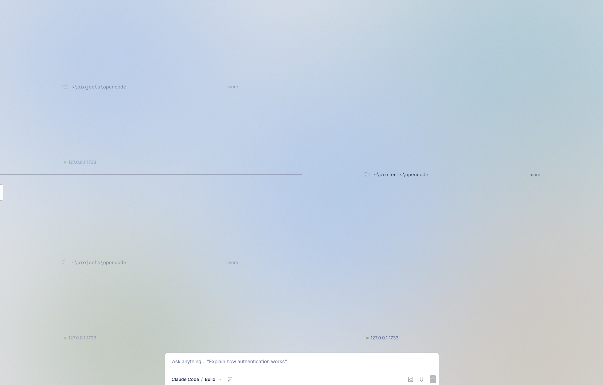

# OpenPoo

A fork of OpenCode with significant UI/UX changes focused on the desktop app.

## Key Differences

### Added
- **Multi-pane system** - Run multiple sessions side-by-side on a single screen
- **Modes** - Switch between Agents (claude-code, codex, opencode)
- **Voice/STT** - Speech-to-text using local ONNX Parakeet model
- **Enhanced UI** - smooth animations, gradient color schemes
- **Mouse** - Right-click specific actions for ease of use.

### Changed
- Modifications to Provider, Model selection UI
- Performance optimizations (message parts caching, git status caching)

### Removed
- **TUI** - Terminal UI completely removed
- **VSCode extension** - Removed in favor of desktop-first approach
